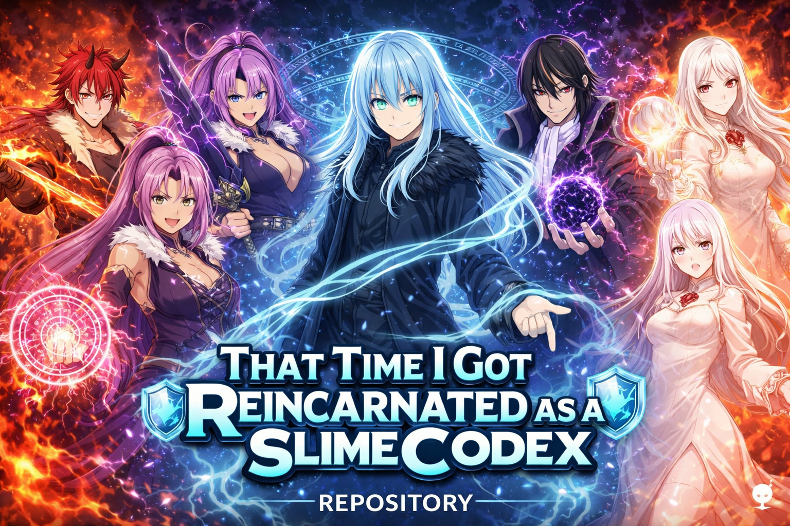
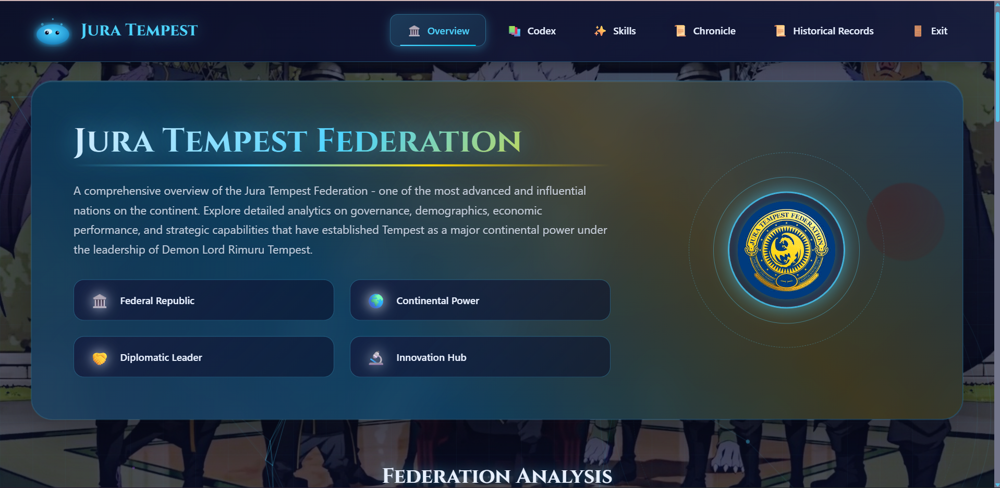
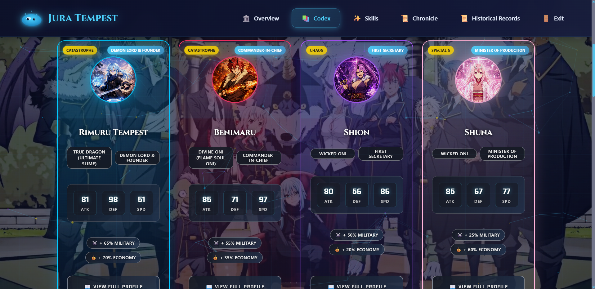
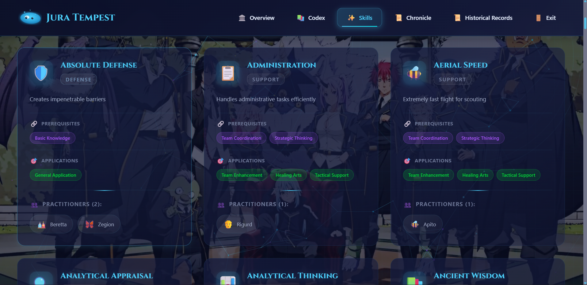
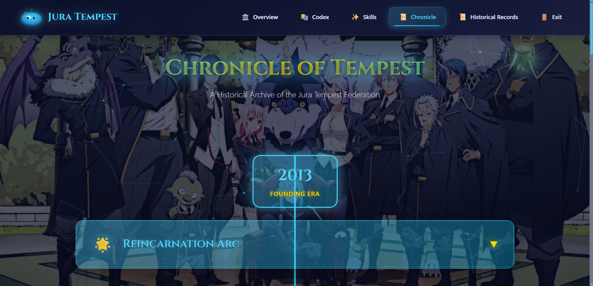

# 🧬 Jura Tempest Federation: Slime Chronicles

<div align="center">


**A visually immersive Tensura codex and chronicle. Explore characters, skills, achievements, and the magical world of Tempest!**

[🌐 Live Demo](https://slimechronicles.netlify.app/) • [📖 Documentation](#-features) • [🐛 Report Bug](https://github.com/Divyansh3105/slimechronicles/issues) • [✨ Request Feature](https://github.com/Divyansh3105/slimechronicles/issues)



</div>

---

## 📖 About The Project

The **Jura Tempest Federation: Slime Chronicles** is a fan-made interactive codex and timeline inspired by _That Time I Got Reincarnated as a Slime_. Built with **HTML, CSS, and JavaScript**, it features:

- 🧑‍🎤 **Character Profiles** – Explore detailed stats, lore, and relationships for all major Tempest characters
- ⚡ **Skills System** – Browse unique abilities, prerequisites, and applications
- 📚 **Interactive Codex** – Comprehensive database of knowledge, lore, and world-building elements
- 🏛️ **Factions & Organizations** – Detailed information about various groups, alliances, and political entities
- 🏆 **Achievements** – Track legendary feats and milestones
- 📜 **Timeline & Records** – Follow Rimuru and the Federation through major events and battles
- 🏛️ **Federation Overview** – Analytics on governance, economy, and technology
- ✨ **Modern UI** – Animated backgrounds, effects, and accessibility features

---

## ✨ Features

### 🎨 Visual & Interactive

- 🌌 **Animated Starfields & Magic Circles** – Dynamic backgrounds for immersive experience
- 🖼️ **Character Art & Codex** – Visual profiles with lore and stats
- 📊 **Timeline Visualization** – Major events, battles, and achievements
- 🎨 **Thematic UI** – Lore-rich, modern, and responsive design

### 🛡️ Data & Gameplay

- 🧑‍🎤 **Character Database** – Search, filter, and sort by race, role, and more
- ⚡ **Skills Explorer** – Prerequisites, applications, and unique abilities
- 📚 **Codex System** – Comprehensive knowledge base with searchable entries
- 🏛️ **Faction Management** – Explore relationships, alliances, and political dynamics
- 🏆 **Achievements** – Track milestones and legendary feats
- 📜 **Historical Records** – Chronicle Rimuru’s journey and Tempest’s rise

### 🖥️ Technical Excellence

- 📱 **Fully Responsive** – Optimized for desktop, tablet, and mobile
- 🚀 **Performance Optimized** – Lazy loading, caching, and device adaptation
- ♿ **Accessibility Ready** – Semantic HTML, ARIA, and high contrast

---

## 🛠️ Tech Stack

<table>
<tr>
<td>

**Frontend**

- HTML5 (Semantic markup)
- CSS3 (Custom properties, animations)
- JavaScript ES6+

</td>
<td>

**Graphics & Animation**

- CSS Animations & Effects
- SVG, PNG assets
- Starfield & magic circle backgrounds

</td>
</tr>
<tr>
<td>

**Data & Storage**

- JSON data structures
- Local caching

</td>
<td>

**Performance**

- Lazy loading
- Optimized DOM manipulation

</td>
</tr>
</table>

---

## 📂 Project Structure

```
slimechronicles/
├── index.html           # Main landing page
├── overview.html        # Federation analytics and stats
├── character.html       # Character profiles
├── skills.html          # Skills database
├── codex.html           # Interactive knowledge base and lore
├── factions.html        # Factions, organizations, and political entities
├── records.html         # Historical records and achievements
├── Chronicle.html       # Timeline and chronological events
├── data/                # Character and event data (JSON)
├── js/                  # Application logic and effects
├── css/                 # Themed stylesheets
├── assets/              # Images and icons
└── README.md            # Project documentation
```

---

## 📸 Screenshots

<div align="center">

### 🔹 Overview Page



### 🔹 Character Codex



### 🔹 Skills Database



### 🔹 Chronical View



</div>

---

## 🚀 Getting Started

### Prerequisites

- A modern web browser (Chrome, Edge, Firefox, Safari)

### Installation

1️⃣ **Clone the repository:**

```bash
git clone https://github.com/Divyansh3105/slimechronicles.git
```

2️⃣ **Navigate to project directory:**

```bash
cd slimechronicles
```

3️⃣ **Launch the app:**

**Option A: Direct Browser Launch**

```bash
# Double-click index.html or open with your browser
```

**Option B: Local Development Server**

```bash
# Using Python 3
python -m http.server 8000

# Using Node.js http-server
npx http-server -p 8000
```

4️⃣ **Access the application:**

```
Open your browser and navigate to: http://localhost:8000
```

---

## 🎯 Purpose & Learning Outcomes

This project was developed as a **portfolio showcase** to demonstrate:

- Advanced front-end skills and creative UI/UX
- Modular JavaScript and data-driven design
- CSS animation and responsive layouts
- Performance and accessibility best practices
- Love for the Tensura universe!

---

## 🌟 Future Enhancements

- 🧙‍♂️ More interactive lore and event visualizations
- 🗺️ Expand world map and location features
- 🏅 User achievement tracking
- 🌗 Dark/light mode toggle
- 🌍 Multi-language support

---

## 🤝 Contributing

Contributions and suggestions are welcome! Fork this repo and submit a PR to improve features, add data, or enhance the UI.

---

## 📜 License

This project is for educational and fan purposes only. All rights to the original series belong to their respective creators. No commercial use intended.

---

<div align="center">

## 👨‍💻 Author

### **Divyansh Garg**

[](https://divyansh3105.github.io/Portfolio/)
[](https://www.linkedin.com/in/divyanshgarg3105)
[](https://github.com/Divyansh3105)
[](mailto:divyanshgarg3105@gmail.com)

**Frontend Developer | UI/UX Enthusiast | Anime Fan**

---

## ⭐ Show Your Support

**If you like this project, consider giving it a star on GitHub and sharing with fellow Tensura fans!**

---

_"In unity, there is strength. In friendship, there is magic."_

</div>
