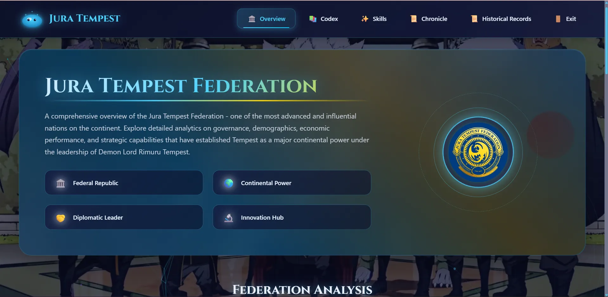

# Slime Chronicles

A fan-made codex for _That Time I Got Reincarnated as a Slime_ (Tensura): characters, skills, factions, a lore codex, historical records and a timeline of the story.

Live: https://slimechronicles.netlify.app/



## What's in it

- **Characters**: 33 profiles with stats, skills, relationships and evolution paths, loaded from `data/characters/*.json`
- **Skills**: every skill across all characters, with search, filters and a skill-fusion toy (`SkillSynthesizer`)
- **Factions, codex, records, chronicle**: the world's nations, terminology, notable events and arcs
- **Extras**: command palette (Ctrl+K), a small battle simulator, an in-page "Great Sage" helper, sound effects and background music
- **Offline**: a service worker precaches the app shell and character data

## Stack

Plain HTML, CSS and JavaScript with no build step. GSAP for scroll animation, particles.js for the background, Font Awesome and Remix Icon for icons. Tests run on Vitest with jsdom; ESLint and Prettier are set up.

## Run it

```bash
git clone https://github.com/Divyansh3105/slimechronicles.git
cd slimechronicles
python -m http.server 8000
```

Open http://localhost:8000. It needs to be served over HTTP (not `file://`) because it fetches JSON and registers a service worker.

```bash
npm install
npm test        # vitest
npm run lint    # eslint
```

## Layout

```
*.html          one page per section
js/             page scripts, plus components/ (custom elements) and utils/
css/            shared.css plus one stylesheet per page
data/           character JSON (basic list + one file per character), factions.json, timeline.json
sw.js           service worker
tests/          vitest specs
```

## Known gaps

- No automated accessibility or cross-browser testing.
- Factions and the chronicle timeline load from JSON, but other pages (records, overview) still keep their content in HTML or JS.

## Credits

Fan project, not affiliated with the series. All characters and story belong to Fuse, Mitz Vah and the anime's producers. No commercial use.

Built by [Divyansh Garg](https://github.com/Divyansh3105).
